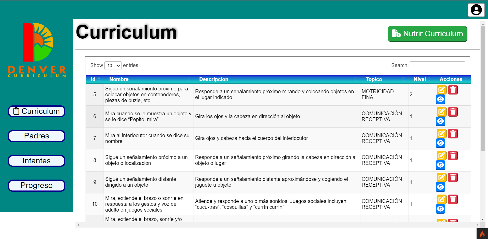
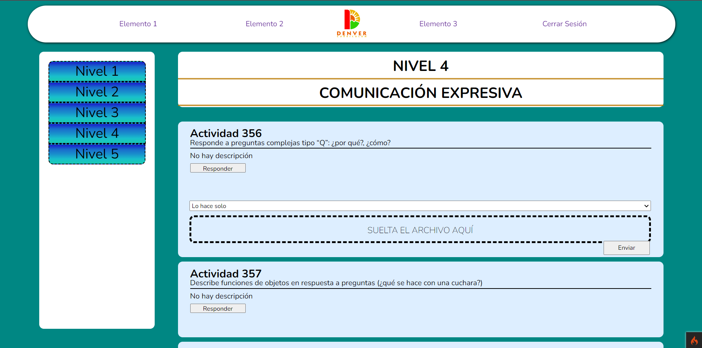

# denverproject
The denver project tries to turn the denver method for children with autism into a web tool accessible to everyone.

# What is the Denver model?
The Denver model is a practical method applied in early care with the aim of prioritizing empirical-scientific knowledge in the study of child development. It is applicable only to children between 12 months and about five years old. And its main feature is its scientific nature: it flees from a more emotional perception to focus on scientific evidence and analyze the effects and causes-consequences of the application of actions.

# Benefits of early intervention
The Denver method seeks to take advantage of brain plasticity (ability to adapt and brain reeducation) that children under 6 years of age have; a very important aspect even in newborns. Brain plasticity refers to the ability of the nervous system to change its structure and functioning throughout life, as a reaction to the diversity of the environment. By acting early, it is possible to effectively stimulate the neural network involved in social behavior and complex behavior, which is called "behavioral plasticity".

# What does the Denver Method consist of?
The stimulation session program is established based on the level of development of the child, which is evaluated from a document that we call a “curriculum”. This indicates the behaviors that must be achieved according to the child's age and according to the part that is to be developed: communication, motor skills, autonomy... With this evaluation, the professionals can then set the objectives, to subsequently carry out a treatment and a personalized assessment.

# Screenshots

